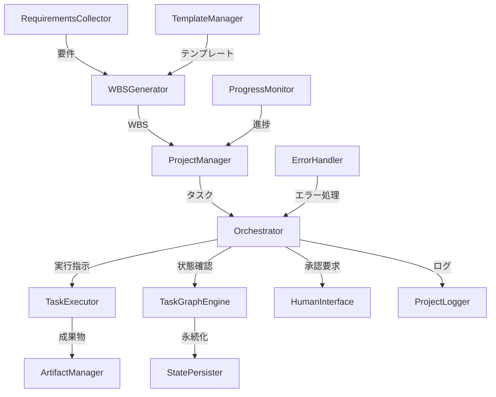

## 📋 AI駆動プロジェクト自動実行システム

### 🎯 やりたいこと
人間が要件を定義したら、AIが自動的にプロジェクトをタスクに分解し、Claude Code等を使って実際に実行。必要に応じて人間の承認を得ながら、最終成果物まで自動生成するシステム。

### 🔥 主なチャレンジ
1. **要件定義対話システム** - GUIで直感的に要件を入力
2. **タスク分析 & WBS作成** - AIによる適切な粒度でのタスク分解
3. **Claude Codeのオーケストレーション** - 複数AIタスクの並列実行管理
4. **Human-in-the-loop** - 適切なタイミングでの人間介入

### 🏗️ アーキテクチャ

#### フェーズとタスクの構造
```
プロジェクト
├── フェーズ1: 要件定義
│   ├── タスク1-1: 機能要件分析
│   └── タスク1-2: 技術選定
├── フェーズ2: 設計
│   ├── タスク2-1: アーキテクチャ設計
│   ├── タスク2-2: データモデル設計
│   └── タスク2-3: API設計
├── フェーズ3: 開発
│   ├── タスク3-1: バックエンド実装
│   └── タスク3-2: フロントエンド実装
└── フェーズ4: テスト
```

- **フェーズ**: ウォーターフォール型で順次実行
- **タスク**: フェーズ内で依存関係に基づいて並列実行可能

### 🔧 主要コンポーネント



### 🔄 システムフロー

1. **要件収集フェーズ**
   ```
   ユーザー → RequirementsCollector → 対話的要件定義
                                    ↓
                              requirements.yaml
   ```

2. **WBS生成フェーズ**
   ```
   requirements.yaml → WBSGenerator → タスク分解
                          ↑              ↓
                   TemplateManager    wbs.yaml
   ```

3. **実行フェーズ**
   ```
   Orchestrator ←→ TaskGraphEngine
        ↓               ↓
   TaskExecutor    状態管理・依存解決
        ↓
   Claude Code実行
        ↓
   ArtifactManager
   ```

4. **Human-in-the-loop**
   ```
   タスク実行中...
        ↓
   [承認が必要なポイント]
        ↓
   HumanInterface → 通知（Web/Slack/Email）
        ↓
   ユーザー承認/修正指示
        ↓
   実行再開
   ```

### 💾 データフロー

```yaml
# 1. 要件定義の出力
requirements:
  project_type: "Webアプリケーション"
  features: ["認証", "CRUD", "リアルタイム"]
  
# 2. WBS生成の出力  
wbs:
  phases:
    - id: requirements
      tasks: [...]
    - id: design
      tasks: [...]

# 3. 実行状態
execution_state:
  task_001:
    status: completed
    outputs: ["api_spec.yaml", "db_schema.sql"]
  task_002:
    status: running
    started_at: "2024-01-10T10:00:00"
```

### 🚀 実装優先順位

1. **Phase 1: コア機能**
   - TaskGraphEngine（依存関係管理）
   - 基本的なTaskExecutor
   - シンプルなOrchestrator

2. **Phase 2: 実用化**
   - WBSGenerator
   - ArtifactManager  
   - StatePersister

3. **Phase 3: UX向上**
   - RequirementsCollector（GUI）
   - HumanInterface
   - ProgressMonitor

4. **Phase 4: 拡張**
   - 複数テンプレート対応
   - 高度なエラーハンドリング
   - スケジューリング機能